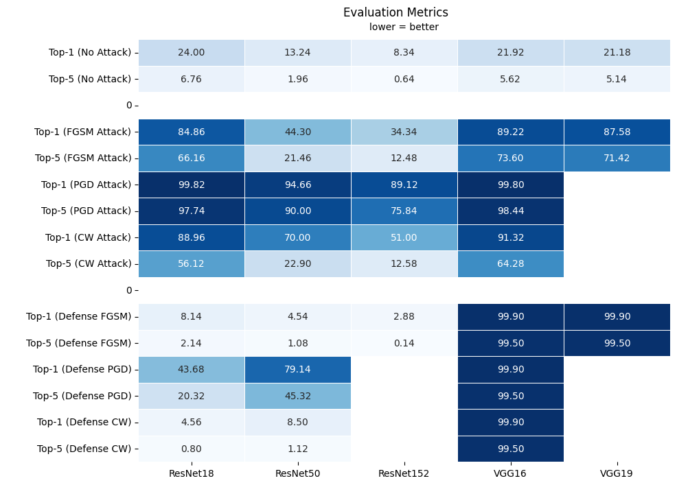

# AI & Security Project

## Sections

1. Project overview
1. Evaluating pretrained models prior to implementing adversarial attacks
1. Attacking the models
1. Increasing the robustness of the models by implementing adversarial training
1. Results

## Project overview

[project overview goes here]

## Evaluating pretrained models prior to implementing adversarial attacks

**Part of: [evaluating_pretrained_models.ipynb](./evaluating_pretrained_models.ipynb)**

We started with evaluating several pre-trained models on our dataset to see how they perform reguraly. We used the weights that were optimised for ImageNet. As expected the pre-trained models performed pretty well.

Top-1 and Top-5 errors are the metrics we decided to use to evaluate the performance of the pre-trained classification models.

| Model     | Top-1 error | Top-5 error |
| --------- | ----------- | ----------- |
| ResNet18  | 24.00%      | 6.76%       |
| ResNet50  | 13.24%      | 1.96%       |
| ResNet152 | **8.34%**   | **0.64%**   |
| VGG16     | 21.92%      | 5.62%       |
| VGG19     | 21.18%      | 5.14%       |

For ResNet18, the model's top prediction is incorrect 24% of the time, and the correct class is not within the top 5 predictions 6.76% of the time.

For ResNet50, the model's top prediction is incorrect 13.24% of the time, and the correct class is not within the top 5 predictions 1.96% of the time.

## Attacking the models

**Part of: [implementing_defensive_techniques.ipynb](./implementing_defensive_techniques.ipynb)**

We chose three attack methods to evaluate the robustness of the models. The three methods are:

- Fast Gradient Sign Method (FGSM)
- Projected Gradient Descent (PGD)
- Carlini-Wagner (CW)

We noticed that the PGD attack was the most effective attack method. In the case of VGG16 the Top-1 error rate increased by 455%, and the Top-5 error rate increased by 1752%.

Visually, the impact of an FGSM attack can be seen in the following graphs:

| Animal            | Baseline                                                                    | FGSM                                                                |
| ----------------- | --------------------------------------------------------------------------- | ------------------------------------------------------------------- |
| Goldfish          |      |      |
| Tench             |            |            |
| Tiger shark       |  |  |
| Great white shark |                |                |

You can see that the FGSM attack has a significant impact on the model's predictions. The model's confidence is reduced. The model is more likely to predict multiple classes instead of just one.

## Increasing the robustness of the models by implementing adversarial training

**Part of: [implementing_defensive_techniques.ipynb](./implementing_defensive_techniques.ipynb)**

We implemented adversarial training to increase the robustness of the models. In most cases, the adversarial training increased the robustness of the models.

For ResNet18 and ResNet50, the adversarial training improved the model's performance beyond the baseline performance (without attack), for the FGSM and CW attacks. For the PGD attack, the adversarial training did not improve the model's performance as much, and it was actually worse than the baseline performance.

Adversarial training did not seem to have an impact on the performance of VGG16, because it ended up performing worse than the performance of the model impacted by the adversarial attacks.

## Results

Still a work in progress. Some fields are empty, and some fields show weird results (VGG16 is completely terrible after adversarial training).

